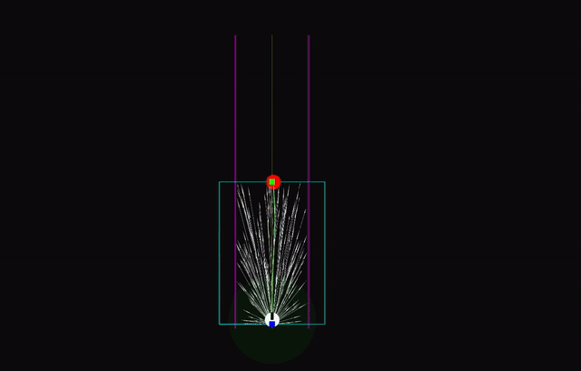
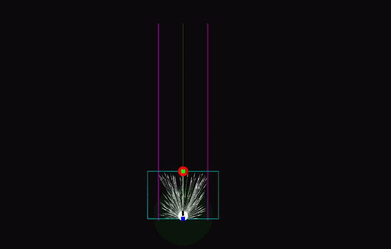
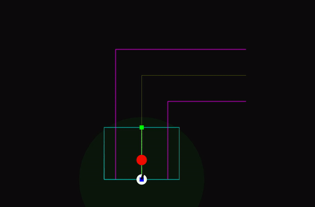

# drive
## description
- Real-time algorithms for following a given path while avoiding initially unknown static obstacles.
- Uses RRT\* and Visibility graph along with padding obstacles.
## roadmap
- Problems solved until now are documented in `report.pdf`
## code
- The project is a typical ROS project.
- `src/` contains all source code.
## documentation
- For most of the code, the documentation is itself.
## usage
- Open a terminal at project root (the directory containing this file).
- `roscore`
- `rviz`
- `source devel/setup.bash`
- `catkin_make && rosrun plan plan_node`
## demonstration

- Straight path with 2 points.

| RRT\* | Visibility graph |
| --- | --- |
|  |  |

- Straight path with 3 points.

| RRT\* | Visibility graph |
| --- | --- |
|  |  |

- Straigh path with 5 points.

| RRT\* | Visibility graph |
| --- | --- |
|  |  |

- Perpendicular turn with 3 points.

| RRT\* | Visibility graph |
| --- | --- |
|  |  |

- Perpendicular turn with 5 points.

| RRT\* | Visibility graph |
| --- | --- |
|  |  |

- Obstacles.

| RRT\* | Visibility graph |
| --- | --- |
|  |  |

- Obstacles over points on given path.

| RRT\* | Visibility graph |
| --- | --- |
|  |  |

- Complete block.

| RRT\* | Visibility graph |
| --- | --- |
|  |  |

- Small passage.

| RRT\* | Visibility graph |
| --- | --- |
|  |  |

- Shielding final point.

| RRT\* | Visibility graph |
| --- | --- |
|  |  |

- Arc.

| RRT\* | Visibility graph |
| --- | --- |
|  |  |

- Arbitrary path (top down view).

| RRT\* | Visibility graph |
| --- | --- |
|  |  |

- Arbitrary path (side view).

- RRT\* planning frequency vs number of sensed obstacles.

- Visibility graph planning frequency vs number of sensed obstacles.

- RRT\* planning frequency vs number of sampled nodes.

